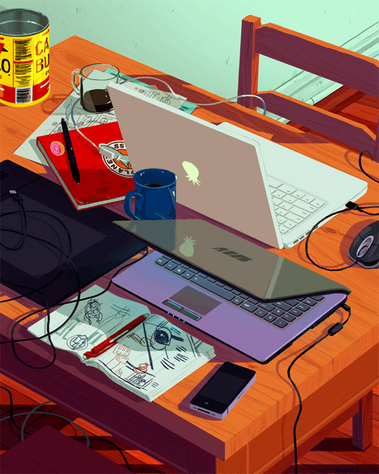

  

  
  

  
  ### Minhas Habilidades 👀
  
 
    
    
    
    
    
    
    
    
    
  

  
 ##
 

 
   
  
   

  <picture align="center">
    <source media="(prefers-color-scheme: dark)" srcset="https://raw.githubusercontent.com/AlexiaCazale/AlexiaCazale/output/github-contribution-grid-snake-dark.svg">
    <source media="(prefers-color-scheme: light)" srcset="https://raw.githubusercontent.com/AlexiaCazale/AlexiaCazale/output/github-contribution-grid-snake-dark.svg">
    
  </picture>

  
